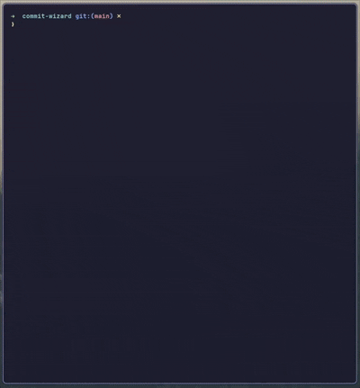

<h1 align="center">commit wizard 🧙</h1>
<p align="center">ai-powered conventional commit message generator</p>

<p align="center"><code>npm i -g @jamiehdev/commit-wizard</code></p>

<div align="center">
  
</div>

---

<details>
<summary><strong>Table of Contents</strong></summary>

<!-- Begin ToC -->

- [quickstart](#quickstart)
- [features](#features)
- [system requirements](#system-requirements)
- [cli reference](#cli-reference)
- [configuration guide](#configuration-guide)
  - [environment variables setup](#environment-variables-setup)
  - [model configuration](#model-configuration)
  - [example configurations](#example-configurations)
- [usage examples](#usage-examples)
- [conventional commits compliance](#conventional-commits-compliance)
- [supported ai providers](#supported-ai-providers)
- [faq](#faq)
- [contributing](#contributing)
  - [development workflow](#development-workflow)
  - [building from source](#building-from-source)
- [security & responsible ai](#security--responsible-ai)
- [license](#license)

<!-- End ToC -->

</details>

---

## quickstart

install via npm:

```shell
npm i -g @jamiehdev/commit-wizard
```

set your OpenRouter API key:

```shell
export OPENROUTER_API_KEY="your-api-key-here"
```

> **note:** you can also place your API key into a `.env` file at the root of your project:
>
> ```env
> OPENROUTER_API_KEY=your-api-key-here
> OPENROUTER_MODEL=deepseek/deepseek-r1-0528:free
> ```

make some changes in your git repository, stage them, and run:

```shell
commit-wizard
```

that's it! commit wizard will:
- analyse your staged changes (or unstaged if nothing is staged)
- generate a conventional commit message using AI
- let you review, edit, or regenerate the message
- commit your changes with the perfect message

---

## features

commit wizard is built for developers who want **consistent, meaningful commit messages** without the mental overhead. It understands your code changes and generates **conventional commits** that make your git history readable and tooling-friendly.

| feature | description |
|---------|-------------|
| **smart analysis** | detects file types, change patterns, and semantic meaning of your changes. |
| **conventional commits** | generates perfectly formatted conventional commit messages. |
| **ai-generated scopes** | creates contextual scopes based on what code sections actually changed. |
| **interactive workflow** | review, edit, regenerate, or commit with confidence. |
| **debug mode** | see the full ai analysis and reasoning with `--debug`. |
| **multiple providers** | supports openrouter, openai, deepseek, and other providers. |
| **format validation** | ensures all messages follow conventional commits specification. |
| **imperative mood** | automatically validates and suggests proper imperative descriptions. |

---

## system requirements

| requirement | details |
|-------------|---------|
| operating systems | macos, linux, windows |
| node.js | 16+ (for npm installation) |
| git | any recent version |
| ai api key | openrouter (recommended) or openai |

---

## cli reference

| command | purpose |
|---------|---------|
| `commit-wizard` | interactive commit message generation |
| `commit-wizard --debug` | show detailed ai analysis and reasoning |
| `commit-wizard --yes` | auto-commit without confirmation |
| `commit-wizard --verbose` | show detailed file change information |
| `commit-wizard --help` | show all available options |

### key flags

| flag | short | description |
|------|-------|-------------|
| `--path <PATH>` | `-p` | specify git repository path (defaults to current directory) |
| `--max-size <KB>` | | maximum file size to analyse in kb (default: 100) |
| `--max-files <NUM>` | `-f` | maximum number of files to analyse (default: 10) |
| `--verbose` | `-v` | show detailed diff information |
| `--yes` | `-y` | automatically commit when confirmed |
| `--debug` | | show debug information including raw ai responses |

### example output:

```bash
$ commit-wizard

🧙 commit-wizard (core engine)
ai-powered conventional commit message generator

✅ generated commit message:

feat(auth): add jwt token validation middleware

? what would you like to do? ›
❯ yes, commit this message
  edit this message  
  no, regenerate message
```

---

## configuration guide

### environment variables setup

commit wizard uses environment variables for configuration. you can set these in your shell or in a `.env` file in your project root.

| variable | required | description | example |
|----------|----------|-------------|---------|
| `OPENROUTER_API_KEY` | yes | your openrouter api key | `sk-or-v1-...` |
| `OPENROUTER_MODEL` | no | ai model to use | `deepseek/deepseek-r1-0528:free` |

### model configuration

the default model is `deepseek/deepseek-r1-0528:free`, which provides excellent code analysis capabilities. you can override this by setting the `OPENROUTER_MODEL` environment variable.

#### popular model options:

| provider | model | description |
|----------|-------|-------------|
| deepseek | `deepseek/deepseek-r1-0528:free` | latest free model with excellent code understanding |
| openai | `gpt-4o-mini` | fast and cost-effective |
| anthropic | `anthropic/claude-3.5-sonnet` | great reasoning capabilities |
| meta | `meta-llama/llama-3.1-8b-instruct:free` | free option with good performance |

### example configurations

**.env file (recommended):**
```env
OPENROUTER_API_KEY=sk-or-v1-your-key-here
OPENROUTER_MODEL=deepseek/deepseek-r1-0528:free
```

**shell configuration:**
```bash
# Add to your ~/.bashrc, ~/.zshrc, etc.
export OPENROUTER_API_KEY="sk-or-v1-your-key-here"
export OPENROUTER_MODEL="deepseek/deepseek-r1-0528:free"
```

---

## conventional commits compliance

commit wizard follows the [conventional commits](https://www.conventionalcommits.org/) specification strictly:

### format
```
<type>[optional scope]: <description>

[optional body]

[optional footer(s)]
```

### supported types
- `feat`: new feature
- `fix`: bug fix
- `docs`: documentation changes
- `style`: formatting changes (no code change)
- `refactor`: code change that neither fixes bug nor adds feature
- `perf`: performance improvements
- `test`: adding/correcting tests
- `build`: build system or dependency changes
- `ci`: ci configuration changes
- `chore`: other changes

### smart scope generation
unlike tools with predefined scopes, commit wizard generates **contextual scopes** based on your actual changes:
- `auth` for authentication-related changes
- `parser` for parsing logic updates
- `api` for api endpoint modifications
- `cli` for command-line interface changes
- and many more based on your codebase!

---

## supported ai providers

commit wizard works with any openai-compatible api. popular choices:

| provider | api base | models | notes |
|----------|----------|--------|-------|
| **openrouter** | `https://openrouter.ai/api/v1` | 100+ models | recommended - access to many models |
| **openai** | `https://api.openai.com/v1` | gpt models | direct openai access |
| **deepseek** | `https://api.deepseek.com` | deepseek models | excellent for code analysis |
| **anthropic** | via openrouter | claude models | great reasoning capabilities |

---

## faq

<details>
<summary><strong>how accurate are the generated commit messages?</strong></summary>

> commit wizard analyses your code changes semantically, detecting file types, change patterns, and the intent behind modifications. the ai generates contextual, meaningful commit messages that accurately reflect what actually changed.

</details>

<details>
<summary><strong>can i edit the generated messages?</strong></summary>

> absolutely! the interactive workflow lets you:
> - accept the message as-is
> - edit it in your preferred editor
> - regenerate a completely new message
> - cancel and make manual commits

</details>

<details>
<summary><strong>what if i don't have staged changes?</strong></summary>

> commit wizard will automatically analyse your unstaged changes and warn you. you can stage the changes you want and run it again, or let it analyse everything and then stage before committing.

</details>

<details>
<summary><strong>how much does it cost to use?</strong></summary>

> using openrouter with the default free model (`deepseek/deepseek-r1-0528:free`) costs nothing. premium models have small per-request costs (typically $0.001-0.01 per commit).

</details>

<details>
<summary><strong>does it work with large codebases?</strong></summary>

> yes! commit wizard has built-in limits (configurable) to analyse only the most relevant changes:
> - maximum file size: 100kb by default (configurable)
> - maximum files: 10 by default (configurable)
> - smart truncation of large diffs

</details>

<details>
<summary><strong>can i use it in ci/cd pipelines?</strong></summary>

> yes! use the `--yes` flag for automated commits:
>
> ```bash
> commit-wizard --yes
> ```
>
> perfect for automated dependency updates, code generation, etc.

</details>

---

## contributing

we welcome contributions! whether you're fixing bugs, adding features, or improving documentation.

### development workflow

1. **fork and clone** the repository
2. **create a feature branch** from `main`
3. **make your changes** with tests
4. **run the test suite**: `cargo test`
5. **check formatting**: `cargo fmt --check`
6. **run clippy**: `cargo clippy -- -D warnings`
7. **open a pull request**

### building from source

```bash
# clone the repository
git clone https://github.com/jamiehdev/commit-wizard.git
cd commit-wizard/commit-wizard-cli

# build in development mode
cargo build

# run tests
cargo test

# run with debug output
cargo run -- --debug

# build release version
cargo build --release
```

---

## security & responsible ai

- **api key security**: store api keys in environment variables or `.env` files, never in code
- **privacy**: your code changes are sent to the ai provider for analysis
- **no data retention**: most providers offer zero data retention options
- **local processing**: all git operations happen locally on your machine

for security concerns, please email [jamie@prettypragmatic.com](mailto:jamie@prettypragmatic.com).

---

## license

this project is licensed under the [mit license](LICENSE).

---

<p align="center">
  made with ❤️ for developers who care about commit quality
</p>
